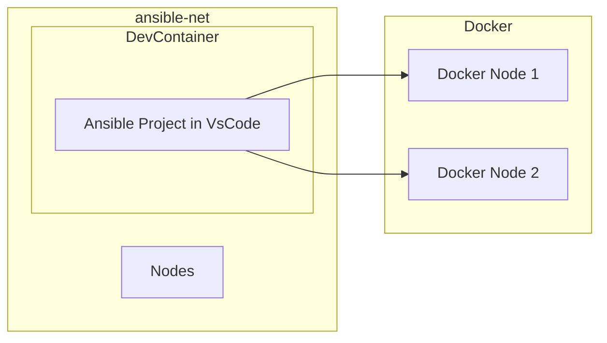

# Ansible_Playground

A playground environment for practicing and testing **Ansible** automation using Docker-based nodes. This setup allows you to experiment with Ansible playbooks, roles, custom modules, and network configurations in an isolated environment.

---

## Architecture

This environment consists of:

- **1 node** created and managed through **VSCode** (Dev Container)
- **2 nodes** created via **Docker Compose**

All nodes are connected through a user-defined Docker network (`ansible-net`) for seamless communication.

### Architecture Diagram



How it works:
- VS Code creates/attaches to a dev container (for example via Remote - Containers).
- The dev container is joined to a bridge network (Docker bridge or a user-defined `ansible-net`) so it can communicate with other nodes.
- Two Ubuntu servers are attached to that same bridge, allowing Ansible control and SSH connectivity across the network.

### Previewing the Mermaid diagram

- GitHub: GitHub renders Mermaid diagrams in Markdown on repository pages — push this change and view the README on GitHub to see it.
- Locally in VS Code: install a Mermaid preview extension (for example, "Markdown Preview Mermaid Support" or "Mermaid Markdown Syntax Highlighting") and open the Markdown preview (Ctrl+Shift+V).

## Prerequisites

Before setting up this playground, ensure you have:

- **Docker** installed on your system  
  [Get Docker](https://www.docker.com/get-started)

- **VSCode** installed with the **Ansible extension/plugins**  
  [VSCode](https://code.visualstudio.com/)

- Basic familiarity with **Ansible** concepts, playbooks, and inventories.

---

## Setting up the Environment

Follow these steps to get the environment ready:

1. **Create a VSCode Workspace**  
   Configure your workspace to make the UI suitable for an Ansible project.

2. **Create the Ansible Project**  
   Initialize your project structure (or clone this repo).

3. **Create the Dev Container**  
   - Edit `devcontainer.json` and add Docker network settings to join `ansible-net`, for example:
     ```json
     {
       "runArgs": ["--network=ansible-net"]
     }
     ```

4. **Create Docker Compose for Additional Nodes**  
   - Use `docker_compose.yml` to define the Ubuntu nodes.
   - Example command to start the nodes:  
     ```bash
     docker-compose up -d
     ```

5. **Verify the Directory Structure**

```
.
├── AGENTS.md
├── README.md
├── ansible.cfg
├── collections
│   └── requirements.yml
├── docker_compose.yml
├── else
│   ├── ansible-navigator.yml
│   ├── argspec_validation_plays.meta.yml
│   ├── argspec_validation_plays.yml
│   ├── devfile.yaml
│   └── run
│       └── README.md
├── files
│   └── sample.conf
├── filter_plugins
│   └── custom_filters.py
├── group_vars
├── host_vars
├── inventory
├── library
├── playbooks
├── roles
└── vars
```

## Usage

- **Start VSCode Dev Container** to access the main node.
- **Start Docker nodes** using Docker Compose:
  ```bash
  docker-compose up -d
  ```
- **Check connectivity between nodes:**
  ```bash
  ansible all -m ping -i inventory/dev/hosts.ini
  ```
- **Run playbooks:**
  ```bash
  ansible-playbook -i inventory/dev/hosts.ini playbooks/setup_tools.yml
  ansible-playbook -i inventory/dev/hosts.ini playbooks/myping_playground.yml
  ```

## Notes

- The `ansible-net` Docker network ensures all nodes can communicate for Ansible orchestration.
- Custom modules are included in `library/` and custom filters in `filter_plugins/`.
- Inventory files are organized by environment (`dev`, `prod`, `uat`) for testing.
- The repository includes example playbooks (`playbooks/`) to help you get started quickly.

---

## References

- [Ansible Documentation](https://docs.ansible.com/)
- [Docker Documentation](https://docs.docker.com/)
- [VSCode Remote - Containers](https://code.visualstudio.com/docs/remote/containers)
